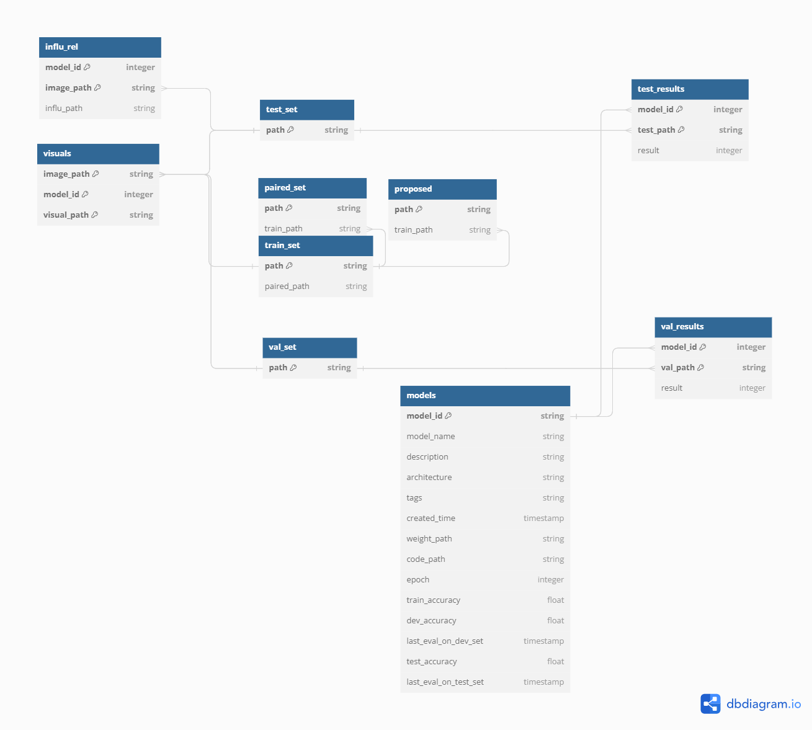

# Database Dev Guide

## Prep

Download `SQLiteStudio` from https://sqlitestudio.pl/ (which is a handy GUI-client for SQLite) and install it.

## Clean up

1. Delete `/Robustar/data.db`
2. Open `SQLiteStudio`. Remove the `robustar-latest` database if it already exists.

## Modifying Database Schema

1. In `SQLiteStudio`, hover on `Database` dropdown and click `Add a database`, select `database/robustar-latest.db` under the project folder. Name the new database `robustar-latest`.
2. Modify the db schema with the GUI as you wish.
3. When done, hover on `Database` dropdown and click `Export the database`.
4. Make sure all tables are checked and **uncheck** `Export data from tables` as we don't need any data in the generated SQL. Click `Next`.
5. Export format is SQL, output as file to `database/robustar-latest.sql` under the project folder folder.
6. Use utf-8 in `Export text encoding`. **Do not** include `DROP IF EXISTS` and **Do not** use SQL formatter.
7. Click `Finish`.

## Update Robustar To Use New Schema

1. Copy the content of newly generated `robustar-latest.sql` file into the `get_init_schema_str` function in `utils/db.py`.
2. Run the backend. A new `/Robustar/data.db` will be generated.
3. Replacing `database/robustar-latest.db` with the newly generated `/Robustar/data.db`.
4. Push the changes.

# V0.3 schema change notes

## Design

- **(new)** visuals
  - image_path (index 1, part-of-pk)
  - model_id (index 1, part-of-pk)
  - visual_path (index 1, part-of-pk)
- influ_rel
  - **(new)** model_id (index 1, part-of-pk)
  - image_path (index 1, part-of-pk)
  - influ_path
- paired_set (no change)
- proposed (no change)
- ~~split~~
- train_set (no change)
- val_set (no change)
  - path (pk)
  - ~~classified~~
- test_set
  - path (pk)
  - ~~classified~~
- **(new)** test_results
  - model_id (index 1, part-of-pk)
  - test_path (index 1, part-of-pk)
  - result
- **(new)** val_results
  - model_id (index 1, part-of-pk)
  - val_path (index 1, part-of-pk)
  - result
- **(new)** models
  - model_id (pk, index 1)
  - model_name (index 2)
  - description
  - architecture
  - tags
  - created_time
  - weight_path
  - code_path
  - train_accuracy
  - dev_accuracy
  - last_eval_on_dev_set
  - test_accuracy
  - last_eval_on_test_set
  - epoch

## Diagram from `dbdiagram.io`



DBML Code:

```
Table visuals {
  image_path string [primary key]
  model_id integer [primary key]
  visual_path string [primary key]
}

Table influ_rel {
  model_id integer [primary key]
  image_path string [primary key]
  influ_path string
}

Table paired_set {
  path string [primary key]
  train_path string
}

Table proposed {
  path string [primary key]
  train_path string
}

Table train_set {
  path string [primary key]
  paired_path string
}

Table val_set {
  path string [primary key]
}

Table test_set {
  path string [primary key]
}

Table test_results {
  model_id integer [primary key]
  test_path string [primary key]
  result integer
}

Table val_results {
  model_id integer [primary key]
  val_path string [primary key]
  result integer
}

Table models {
  model_id string [primary key]
  model_name string
  description string
  architecture string
  tags string
  created_time timestamp
  weight_path string
  code_path string
  epoch integer
  train_accuracy float
  dev_accuracy float
  last_eval_on_dev_set timestamp
  test_accuracy float
  last_eval_on_test_set timestamp
}

// path relations
Ref: paired_set.train_path > train_set.path
Ref: proposed.train_path > train_set.path
Ref: test_results.test_path > test_set.path
Ref: val_results.val_path > val_set.path
Ref: visuals.image_path > train_set.path
Ref: visuals.image_path > val_set.path
Ref: visuals.image_path > test_set.path
Ref: influ_rel.image_path > test_set.path

// model relations
Ref: val_results.model_id > models.model_id
Ref: test_results.model_id > models.model_id

```
