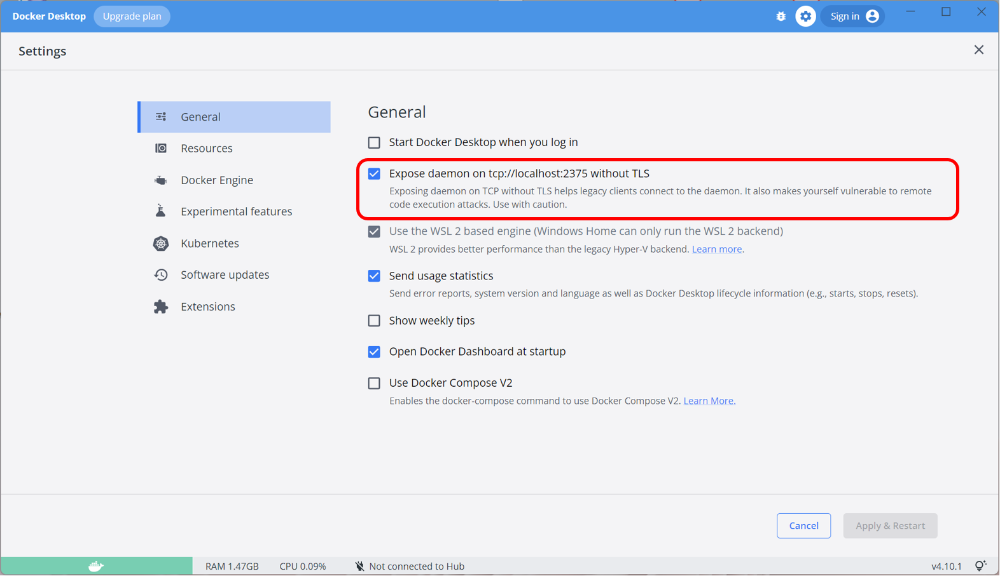

# Robustar launcher

## Setup
```
pip install -r requirements.txt
```


## Running
First, make sure your docker service is running (If you are using Windows, please make sure the setting option in the red box as shown below is checked).



Then, run the python script.

```
python app.py
```

## Packaging
To package the launcher, it is recommended to create a new python environment. You can use `Conda` or `Virtualenv` to do so. The following instructions use `Conda`.
First, create a new environment with necessary packages:

```
conda create -n <name-of-env> python=3.9
conda activate <name-of-env>
pip install -r requirements_pkg.txt
```
Then run:
```
pyinstaller app.spec
```
After that you shall see a new folder `\launcher\dist`, inside it is the newly packaged launcher. 

## FAQ
### Error: `pywintypes.error: (2, 'CreateFile', 'The system cannot find the file specified while installing Sitecore Docker images)`
Make sure your docker service is running.

### Error `NameError: name 'NpipeHTTPAdapter' is not defined`

This error is most likely due to an update of `docker`. You can fix it by running the following command:

`python <path-to-python-env>\Scripts\pywin32_postinstall.py -install`

For example:

`python c:\users\my_user_name\anaconda3\envs\ck\Scripts\pywin32_postinstall.py -install`

Or you can simply start a new `Conda` environment with `python3.9`, and go through the setup again.